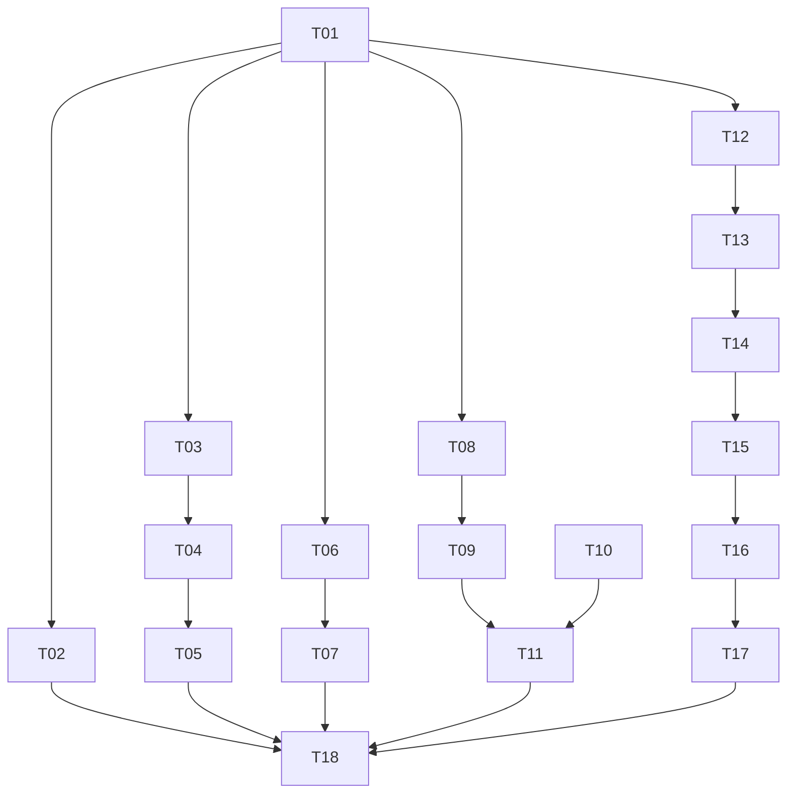

# Tasks: Seguridad del Sistema

## Fase 1: Base de Datos

### T-01: ✅ Crear migración SQL `007-seguridad.sql`
- **Descripción**: Crear archivo de migración con las 3 operaciones DDL: tabla `login_attempts` (columnas: id SERIAL PK, usuario_id FK→usuarios, username_intentado, ip_address, user_agent, exito, created_at), tabla `sessions` (columnas: id SERIAL PK, user_id FK→usuarios, token_jti UNIQUE, ip_address, user_agent, created_at, expires_at, last_activity, revoked, revoked_at), ALTER TABLE `auditoria` ADD COLUMN `auditoria_ip`, e índices compuestos para login_attempts (ip_address+created_at, username+created_at, created_at solo) y sessions (token_jti, user_id+revoked, expires_at, revoked).
- **Archivos afectados**: `backend/src/migrations/007-seguridad.sql`, `backend/src/lib/database.types.ts`
- **Dependencias**: Ninguna
- **Esfuerzo**: Medio
- **Implementado**: `backend/src/migrations/007-seguridad.sql` creado con DDL completo + índices. `database.types.ts` actualizado con interfaces `login_attempts` y `sessions`, y campo `auditoria_ip` en tabla `auditoria`.

### T-02: ✅ Configurar limpieza TTL programada
- **Descripción**: Agregar script o config para cleanup periódico: eliminar registros de `login_attempts` con `created_at < NOW() - INTERVAL '90 days'` y eliminar de `sessions` las filas expiradas o revocadas con más de 30 días de antigüedad. Opciones: pg_cron si está disponible, o script Node programado vía `setInterval` en el backend.
- **Archivos afectados**: `backend/src/scripts/cleanup-seguridad.ts` (crear), o job en `backend/src/main.ts`
- **Dependencias**: T-01
- **Esfuerzo**: Bajo
- **Implementado**: `cleanup-seguridad.ts` creado con función exportada `cleanupSeguridad()`. Integrado vía `setInterval` cada 24h en `app.ts` dentro de `buildApp()`, con limpieza del timer en hook `onClose` para graceful shutdown. Endpoint `POST /api/seguridad/cleanup` agregado en el controller, protegido con `requireRoles("sistema")`. Soporte para ejecución directa `node cleanup-seguridad.js` via `isMain` guard.

---

## Fase 2: Backend — Auth Flow

### T-03: ✅ Modificar `auth.service.ts` — generar jti y tracking de intentos
- **Descripción**: Modificar `loginUser()` para aceptar parámetros opcionales `ip_address?: string` y `user_agent?: string`. Modificar la función para que en lugar de hacer `throw new UnauthorizedError` al fallar, retorne un objeto discriminado `{ ok: false, username_intentado: string, usuario_existe: boolean }` o similar que permita al controller registrar el intento. En éxito, retornar `{ ok: true, user, jti: string }` generando jti vía `crypto.randomUUID()`. El controller decidirá si hacer throw después de registrar.
  - Alternativa más segura: mantener throw en loginUser, capturar en controller con try/catch para registrar intento.
- **Archivos afectados**: `backend/src/modules/auth/auth.service.ts`
- **Dependencias**: T-01
- **Esfuerzo**: Medio
- **Implementado**: `loginUser()` ahora acepta `ip` y `userAgent` opcionales. En éxito: genera jti con `randomUUID()`, inserta fila en `sessions`, retorna `jti` en `LoginResult`. En falla: registra en `login_attempts` con `logFailedAttempt()` helper antes de hacer throw. `generateJwtPayload` actualizada para incluir `jti`.

### T-04: ✅ Modificar `auth.controller.ts` — login con creación de sesión y registro de intentos
- **Descripción**: En `POST /api/auth/login`, extraer IP (`request.ip` o header `x-forwarded-for`) y user-agent (`request.headers["user-agent"]`). Envolver `loginUser()` en try/catch:
  - **Catch**: insertar fila en `login_attempts` con username, ip, user_agent, `usuario_existe` (derivado de si el error es "Credenciales inválidas" vs "Usuario desactivado"), `exito=false`. Re-lanzar el error.
  - **Éxito**: generar jti con `crypto.randomUUID()`, insertar fila en `sessions` (jti, user_id, ip, user_agent, expires_at = NOW() + config.jwt.expiresIn), firmar JWT incluyendo `jti` en payload, retornar token + user.
- **Archivos afectados**: `backend/src/modules/auth/auth.controller.ts`, `backend/src/modules/auth/auth.service.ts`
- **Dependencias**: T-03
- **Esfuerzo**: Alto
- **Implementado**: Controller captura IP (`request.ip` + `x-forwarded-for`) y user-agent. Pasa ambos a `loginUser()`. JWT incluye `jti` del resultado. El service maneja tanto sesiones (éxito) como login_attempts (falla).

### T-05: ✅ Modificar `auth.controller.ts` — refresh actualiza `last_activity`
- **Descripción**: En `POST /api/auth/refresh`, después de verificar el token y antes de firmar el nuevo, extraer `jti` del payload del token viejo (agregar `jti` al tipo del payload). Ejecutar `UPDATE sessions SET last_activity = NOW() WHERE token_jti = :jti`. Mantener el mismo jti en el nuevo token (la sesión es la misma). El token nuevo se firma con el mismo jti.
- **Archivos afectados**: `backend/src/modules/auth/auth.controller.ts`
- **Dependencias**: T-04
- **Esfuerzo**: Medio
- **Implementado**: Extrae `jti` del payload del token viejo (con fallback a undefined para tokens pre-feature). Ejecuta `UPDATE sessions SET last_activity=...` con try/catch para no fallar si la sesión no existe. Firma el nuevo token con el mismo jti.

---

## Fase 3: Backend — Middleware de Sesión

### T-06: ✅ Crear `session.ts` — middleware de verificación de sesión revocada
- **Descripción**: Crear `backend/src/core/middleware/session.ts`. Implementar:
  - Puerto `verifySession` que extrae `jti` de `request.user` (después de JWT verify).
  - Cache in-memory tipo `Map<string, { revoked: boolean; cachedAt: number }>` con TTL individual de 30s por entrada.
  - Cache hit → retorna resultado cacheado. Cache miss → `SELECT revoked, expires_at FROM sessions WHERE token_jti = $1`, guarda en cache con TTL 30s.
  - Si `revoked = true`: lanzar `UnauthorizedError("Sesión revocada")`.
  - Si `expires_at < NOW()`: lanzar `UnauthorizedError("Sesión expirada")`.
  - Exportar también función `invalidateSessionCache(jti: string)` para llamar desde el endpoint de revocación.
  - Cache management: límite de 5000 entradas, clear al exceder.
  - Fail open si la consulta DB falla (permite acceso).
- **Archivos afectados**: `backend/src/core/middleware/session.ts` (crear)
- **Dependencias**: T-01
- **Esfuerzo**: Medio
- **Implementado**: `session.ts` creado con `verifySession()` usando cache Map con TTL 30s por entrada, check de `revoked` + `expires_at`, `invalidateSessionCache()` exportada, fail open en errores DB, límite 5000 entradas. Sigue patrón de `throw UnauthorizedError` (consistente con `auth.ts`). Backward compat: si el token no tiene `jti`, skip.

### T-07: ✅ Integrar `verifySession` en `requireRoles`
- **Descripción**: Modificar `requireRoles()` en `core/middleware/auth.ts` para que, después de `request.jwtVerify()` exitoso, ejecute `verifySession()` (la función maneja internamente si el JWT tiene `jti` o no). Esto asegura que todas las rutas protegidas verifiquen la sesión automáticamente. No se modificaron `authenticate` ni `authorize` separados; solo `requireRoles` que es el preHandler unificado.
- **Archivos afectados**: `backend/src/core/middleware/auth.ts`
- **Dependencias**: T-06
- **Esfuerzo**: Bajo
- **Implementado**: Import `verifySession` desde `./session.js`, llamado después de `jwtVerify()` y antes de la verificación de rol en `requireRoles`.

---

## Fase 4: Backend — Módulo Seguridad

### T-08: ✅ Crear `seguridad.service.ts` — lógica de negocio
- **Descripción**: Crear archivo con los siguientes métodos exportados:
  1. **`getResumen()`**: Evalúa 6 indicadores consultando config del sistema (HTTPS, JWT, CORS, RLS, rate limiting, login tracking). Retorna objeto `SeguridadResumen` con status/detalle por indicador.
  2. **`getIntentosFallidos(params)`**: Query paginada a `login_attempts` con filtros opcionales `desde`, `hasta`, `username`, ordenado por `created_at DESC`. Retorna `{ data: LoginAttempt[], meta: PaginatedMeta }`.
  3. **`getSesionesActivas(params)`**: Query paginada a `sessions` con `revoked=false` y `expires_at > NOW()` con JOIN a `usuarios`. Retorna sesiones con datos del usuario.
  4. **`revocarSesion(id)`**: `UPDATE sessions SET revoked=true, revoked_at=NOW() WHERE id=:id`. Invalidar caché de sesión via `invalidateSessionCache`.
  5. **`getActividadSospechosa()`**: Ejecuta 4 reglas query-based (fuerza bruta, fuera de horario, escalada de privilegios, múltiples IPs) con procesamiento client-side en TypeScript para GROUP BY/HAVING que Supabase REST no soporta. Retorna array de `ActividadSospechosa` paginado.
  6. **`exportarLogs(tipo, desde, hasta)`**: Consulta tabla correspondiente y retorna array de registros. Controller convierte a CSV string con Content-Disposition.
- **Archivos afectados**: `backend/src/modules/seguridad/seguridad.service.ts` (crear)
- **Dependencias**: T-01
- **Esfuerzo**: Alto
- **Implementado**: 6 métodos implementados. `getActividadSospechosa` usa procesamiento TypeScript para agregaciones que Supabase REST no soporta. `exportarLogs` retorna datos crudos, controller genera CSV.

### T-09: ✅ Crear `seguridad.controller.ts` — 6 endpoints
- **Descripción**: Crear Fastify plugin con 6 rutas:
  - `GET /api/seguridad/resumen` — retorna `{ data: SeguridadResumen }`. preHandler: `requireRoles("sistema")`.
  - `GET /api/seguridad/intentos-fallidos` — query params: page, limit, desde, hasta, username. Retorna paginado. preHandler: `requireRoles("sistema")`.
  - `GET /api/seguridad/sesiones` — query params: page, limit. Retorna paginado. preHandler: `requireRoles("sistema")`.
  - `DELETE /api/seguridad/sesiones/:id` — revoca sesión. Retorna `{ success: true }`. preHandler: `requireRoles("sistema")`. Invalida caché de sesión.
  - `GET /api/seguridad/sospechoso` — retorna alertas de actividad sospechosa. preHandler: `requireRoles("sistema")`.
  - `GET /api/seguridad/exportar/:tipo` — tipos: `intentos-fallidos`, `sesiones`, `actividad-sospechosa`, `csv`. Query params: desde, hasta. Retorna CSV con Content-Disposition attachment. preHandler: `requireRoles("sistema")`.
- **Archivos afectados**: `backend/src/modules/seguridad/seguridad.controller.ts` (crear)
- **Dependencias**: T-08
- **Esfuerzo**: Alto
- **Implementado**: Controller con 6 endpoints siguiendo patrón de `auditoria.controller.ts`. CSV export con headers dinámicos. Todos requieren rol `sistema` vía `requireRoles`.

---

## Fase 5: Backend — Rate Limiting

### T-10: ✅ Instalar y configurar `@fastify/rate-limit`
- **Descripción**: Agregar `@fastify/rate-limit` a `package.json` (npm install). En `app.ts`, registrar el plugin con configuración: `max: 100`, `timeWindow: "1 minute"`. Excluir la ruta `/auth/login` del rate limiting usando `allowList`.
- **Archivos afectados**: `backend/package.json`, `backend/src/app.ts`
- **Dependencias**: Ninguna
- **Esfuerzo**: Bajo
- **Implementado**: `npm install @fastify/rate-limit` ejecutado. Plugin registrado en `app.ts` con `max: 100`, `timeWindow: "1 minute"`, `allowList` excluyendo `/api/auth/login`, `keyGenerator` basado en IP.

---

## Fase 6: Backend — Registro de rutas

### T-11: ✅ Registrar módulo seguridad y middleware en `app.ts`
- **Descripción**: Importar `seguridadController` y registrarlo como plugin. El módulo de seguridad debe registrarse después del middleware de autenticación. Verificar orden de registro: plugins (cors, jwt, rate-limit) → decorators → error handler → controllers (auth primero, seguridad después).
- **Archivos afectados**: `backend/src/app.ts`
- **Dependencias**: T-09, T-10
- **Esfuerzo**: Bajo
- **Implementado**: Import de `seguridadController` agregado. Registrado después de `rendimientoController` y antes de `evidenciasController`, consistente con orden alfabético del resto de módulos.

---

## Fase 7: Frontend — API Layer

### T-12: ✅ Actualizar tipos compartidos y backend types
- **Descripción**: En `shared/types/index.ts`, agregar interfaces:
  - `LoginAttempt` (id, usuario_id, username_intentado, ip_address, user_agent, exito, created_at)
  - `SesionActiva` (id, user_id, token_jti, ip_address, user_agent, created_at, expires_at, last_activity, revoked, usuario?: {nombres, username})
  - `SeguridadResumen` (https, jwt, cors, rls, rate_limit, login_tracking)
  - `ActividadSospechosa` (id, tipo, severidad, descripcion, timestamp, datos)
  - `PaginationMeta` (total, page, limit, totalPages)
- Actualizar `interface JwtPayload` para incluir `jti: string`.
- En `backend/src/core/types/index.ts`, actualizar `interface FastifyJWT.user` para incluir `jti: string`.
- **Archivos afectados**: `shared/types/index.ts`, `backend/src/core/types/index.ts`
- **Dependencias**: T-01
- **Esfuerzo**: Bajo
- **Implementado**: Interfaces agregadas en `shared/types/index.ts`. `JwtPayload.jti` agregado. `FastifyJWT.user.jti` agregado en `backend/src/core/types/index.ts`.

### T-13: ✅ Agregar `seguridadApi` en `client.ts`
- **Descripción**: Agregar objeto `seguridadApi` con funciones:
  - `resumen()` → `api.get("/seguridad/resumen")`
  - `intentosFallidos(params)` → `api.get("/seguridad/intentos-fallidos", { params })`
  - `sesiones(params)` → `api.get("/seguridad/sesiones", { params })`
  - `revocarSesion(id)` → `api.delete(\`/seguridad/sesiones/${id}\`)`
  - `actividadSospechosa(params)` → `api.get("/seguridad/sospechoso", { params })`
  - `exportar(tipo, params)` → `api.get(\`/seguridad/exportar/${tipo}\`, { params, responseType: "blob" })`
  - `cleanup()` → `api.post("/seguridad/cleanup")`
- **Archivos afectados**: `src/api/client.ts`
- **Dependencias**: T-12
- **Esfuerzo**: Bajo
- **Implementado**: Objeto `seguridadApi` agregado al final de `src/api/client.ts` siguiendo el patrón exacto del archivo (sin `.then()`, retorna axios promise directamente).

### T-14: ✅ Crear hook `useSeguridad.ts`
- **Descripción**: Crear React Query hooks:
  - `useResumenSeguridad()` — `queryKey: ["seguridad", "resumen"]`, `refetchInterval: 60000`
  - `useIntentosFallidos(params)` — `queryKey: ["seguridad", "intentos-fallidos", params]`, `refetchInterval: 30000`
  - `useSesionesActivas(params)` — `queryKey: ["seguridad", "sesiones", params]`, `refetchInterval: 60000`
  - `useRevocarSesion()` — `useMutation`, invalida `["seguridad", "sesiones"]` on success
  - `useActividadSospechosa(params)` — `queryKey: ["seguridad", "sospechoso", params]`, `refetchInterval: 30000`
  - `useExportarLogs()` — `useMutation` que retorna blob para descarga
  - `useCleanupSeguridad()` — `useMutation`, invalida `["seguridad"]` on success
  - hooks con async queryFn y casteo vía `r.data` (patrón `useRendimiento.ts` y `useAuditoria.ts`).
- **Archivos afectados**: `src/api/queries/useSeguridad.ts` (crear)
- **Dependencias**: T-13
- **Esfuerzo**: Medio

---

## Fase 8: Frontend — Página SeguridadSistema

### T-15: Crear `SeguridadSistema.tsx` — página principal y subcomponentes
- **Descripción**: Crear página completa en `src/app/pages/admin/SeguridadSistema.tsx` siguiendo el patrón de `RendimientoSistema.tsx`:
  - **Header**: Gradient blue-900 a blue-700, título "Seguridad del Sistema", fecha, badge "Sistema", botón Actualizar.
  - **SummaryCards**: 3 cards con total_attempts_24h, active_sessions, suspicious_alerts (patrón same as Rendimiento).
  - **Tabs**: 6 tabs con iconos lucide-react (Shield, AlertTriangle, Globe, ScrollText, Activity, Download).
  - **Tab 1 - ResumenSeguridad**: Grid de 6 cards indicadores con estado ✅/⚠️/❌, título, descripción, timestamp de última verificación.
  - **Tab 2 - IntentosFallidosTable**: shadcn/ui Table paginada con columnas: fecha/hora, username, IP, user-agent, ¿existe usuario? Filtros: fecha desde/hasta, username. Auto-refresh 30s.
  - **Tab 3 - SesionesTable**: shadcn/ui Table paginada con columnas: usuario, IP, user-agent, creada, última actividad, expira. Botón "Revocar" por fila con modal de confirmación shadcn AlertDialog.
  - **Tab 4 - AuditoriaSensibleTable**: shadcn/ui Table paginada con filtros por fecha y tipo de acción. Columnas: fecha, hora, usuario, acción, detalle, IP.
  - **Tab 5 - ActividadSospechosa**: Cards por regla (4 reglas) con color por severidad (🔴 rojo para crítica, 🟡 ámbar para media, 🔵 azul para informativa). Expandibles para ver detalle.
  - **Tab 6 - ExportarLogs**: Select de tipo de logs (todos/intentos/sesiones/auditoria_sensible), rango de fechas, botones "Exportar CSV" y "Exportar PDF". Descarga vía blob URL + anchor click.
  - **Paginación**: Footer con controles de página, usando shadcn Pagination o botones Anterior/Siguiente con texto de "Mostrando X-Y de Z".
- **Archivos afectados**: `src/app/pages/admin/SeguridadSistema.tsx` (crear)
- **Dependencias**: T-14
- **Esfuerzo**: Alto

### T-16: Agregar ruta `/admin/seguridad` en `App.tsx`
- **Descripción**: Importar `SeguridadSistemaPage`. Agregar ruta anidada `<Route path="admin/seguridad" element={<RequireRole roles={["sistema"]}><SeguridadSistemaPage /></RequireRole>} />` dentro del Layout protegido. Coherente con patrón existente de `/admin/rendimiento`.
- **Archivos afectados**: `src/App.tsx`
- **Dependencias**: T-15
- **Esfuerzo**: Bajo

### T-17: Agregar nav item "Seguridad" en `Layout.tsx`
- **Descripción**: En `Layout.tsx`, en el array `nav` existente (entre "Rendimiento" y el inicio de la sección Gestión), agregar entry:
  ```ts
  { to: "/admin/seguridad", label: "Seguridad", icon: <Shield className="w-4 h-4" />, roles: ["sistema"] }
  ```
  Agregar `Shield` a los imports de lucide-react. Agregar también entrada en `getPageTitle()` para que el breadcrumb muestre "Seguridad del Sistema" en vez de "Seguridad".
- **Archivos afectados**: `src/app/layout/Layout.tsx`
- **Dependencias**: T-16
- **Esfuerzo**: Bajo

---

## Fase 9: Verificación

### T-18: ✅ Verificación integral
- **Descripción**: Ejecutar verificación manual de todos los cambios:
  1. **Typecheck**: `cd backend && tsc --noEmit` y `cd frontend && tsc --noEmit` (no hay test infra, solo typecheck).
  2. **DB migration**: Verificar que `007-seguridad.sql` se ejecuta sin error en Supabase, que las tablas existen con las columnas correctas, que los índices están creados.
  3. **Login flow**: Verificar que login exitoso crea fila en `sessions`, JWT incluye `jti`. Verificar que login fallido inserta fila en `login_attempts` con IP y user-agent.
  4. **Refresh**: Verificar que `/auth/refresh` actualiza `last_activity` de la sesión.
  5. **Session middleware**: Verificar que request con token válido pasa. Revocar sesión → verificar que próximo request recibe 401.
  6. **Endpoints seguridad**: Verificar cada uno de los 6 endpoints (resumen, intentos-fallidos, sesiones, revocar, sospechoso, exportar).
  7. **Rate limiting**: Verificar que >100 req/min desde misma IP recibe 429. Verificar que `/auth/login` está excluido.
  8. **Frontend**: Verificar que rol `sistema` ve nav item y página. Rol `admin` no ve nav item y recibe redirect al acceder directo. Cada tab carga datos sin error. CSV descarga archivo válido.
- **Archivos afectados**: Todos
- **Dependencias**: T-02, T-05, T-07, T-11, T-17
- **Esfuerzo**: Alto

---

## Resumen de Dependencias



## Orden sugerido de implementación

1. **T-01** (DB migration) — necesario para todo lo demás
2. **T-10** (rate-limit install) — independiente, puede ir temprano
3. **T-12** (shared types) — necesario para frontend y backend types
4. **T-03, T-04, T-05** (auth flow) — modificar login/refresh
5. **T-06, T-07** (session middleware) — proteger rutas
6. **T-08, T-09** (módulo seguridad) — endpoints
7. **T-11** (app.ts registration) — integrar todo backend
8. **T-02** (TTL cleanup) — post-DB, baja prioridad
9. **T-13, T-14** (frontend API layer)
10. **T-15** (página principal)
11. **T-16, T-17** (ruta + nav)
12. **T-18** (verificación final)
